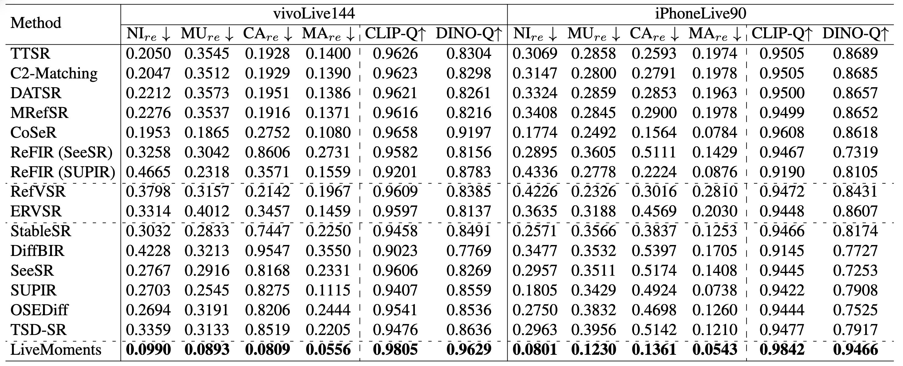

<div align="center">


<h1>LiveMoments: Reselected Key Photo Restoration in Live Photos via Reference-guided Diffusion</h1>

<div>
    <a href="https://github.com/OpenVeraTeam/LiveMoments" target="_blank">Clara Xue</a><sup>1*</sup>&emsp;
    <a href="https://scholar.google.com/citations?user=Dt5LAqcAAAAJ&hl=en" target="_blank">Zizheng Yan</a><sup>1*</sup>&emsp;
    <a href="https://scholar.google.com/citations?user=IJiK74oAAAAJ&hl=en" target="_blank">Zhenning Shi</a><sup>1,2</sup>&emsp;
    <a href="https://github.com/OpenVeraTeam/LiveMoments" target="_blank">Yuhang Yu</a><sup>1</sup>&emsp;
    <a href="https://scholar.google.com/citations?hl=en&user=xuljwP8AAAAJ" target="_blank">Jingyu Zhuang</a><sup>1</sup>&emsp;
    <a href="https://qzhang-cv.github.io/" target="_blank">Qi Zhang</a><sup>1</sup>&emsp;
    <a href="https://scholar.google.com/citations?hl=zh-CN&user=Pcsml4oAAAAJ" target="_blank">Jinwei Chen</a><sup>1</sup>&emsp;
    <a href="https://fqnchina.github.io/" target="_blank">Qingnan Fan</a><sup>1†</sup>
</div>
<div>
    <sup>1</sup>vivo BlueImage Lab, <sup>2</sup>College of Computer Science, Nankai University
</div>

<h4>
<p align="center">
<a href="https://arxiv.org/abs/2604.12286">📄 arXiv Paper</a> &nbsp; 
<a href="https://clara7-c.github.io/livemoments/">🔗 Project Page</a> &nbsp;
</p>
</h4>

#### 🚩Accepted by ICLR 2026

</div> 

## ✨ Highlights


🎞️ **A new task: Reselected Key Photo Restoration in Live Photos**  
Unlike traditional settings, our task addresses a practical scenario where users reselect a new key photo from a Live Photo, which often suffers from degraded quality. We restore a single low-quality frame using the original key photo as a high-quality reference from the same sequence, defining a novel subcategory of reference-based super-resolution (RefSR).

🧩 **LiveMoments: A diffusion-based framework for reselected key photo restoration**  
Our method restores reselected key photos using in-sequence references, with a unified Motion Alignment module to handle spatial misalignment at both latent and image levels. It significantly outperforms existing RefSR and SISR methods in both quantitative metrics and visual quality, even under challenging real-world scenarios.

## 🔍 Overview


🌟 If LiveMoments is helpful to your projects or Live Photos, please help star this repo. Thanks! :hugs:

## ⚙️ Dependencies and Installation
```
# git clone this repository
git clone https://github.com/OpenVeraTeam/LiveMoments.git
cd LiveMoments

# create an environment 
conda create -n livemoments python=3.10
conda activate livemoments
pip install -r requirements.txt
```

## 🚀 <a name="start"></a>Quick Start
#### Step 1: Download the pretrained models
- Download the pretrained SD3 models from [HuggingFace](https://huggingface.co/stabilityai/stable-diffusion-3-medium-diffusers/tree/main).
- Clone the official RAFT repository from [GitHub](https://github.com/princeton-vl/RAFT) and download the pretrained weights (Sintel).
> ⚠️ Note: When using RAFT, we recommend commenting out the lines in `/path/to/your/RAFT/core/raft.py` that normalize the input image tensors to the range `[-1, 1]`.

- Download our pretrained weights from [HuggingFace](https://github.com/OpenVeraTeam/LiveMoments).

You can put the model weights in `checkpoint/`.

#### Step 2: Prepare testing data
You can put the testing images in `imgs/test`. The testing data should consist of three components:
- the reselected key photo
- the original key photo
- the corresponding low-resolution (LR) original key photo, which can be obtained by extracting the corresponding frame from the Live Photo video.

#### Step 3: Configure paths

Please update the YAML configuration file `config/inference_config.yml` by specifying the paths to the pretrained model weights, RAFT model, and the testing data.

Ensure that all paths are valid before running inference.

#### Step 4: Run testing command
```
python infer/infer_LiveMoments.py \
--output_dir /your/output_dir \
--output_dir_name your_output_dir_name
```


## <a name="results"></a>🖼️ Results

<details>
    <summary> <b>Quantitative comparison</b> with RefSR and SISR methods on real-world Live Photo datasets. (click to expand). </summary>
    <p align="center">
    
    </p>
</details>

<details>
    <summary> <b>Visual comparison</b> on the two real-world Live Photo datasets: vivoLive144 (1st-2nd rows) and iPhoneLive90 (3rd-4th rows). </summary>
    <p align="center">
    
    </p>
    <p align="center">
    
    </p>
    <p align="center">
    
    </p>
    <p align="center">
    
    </p>
</details>

## ✅ <a name="TODO"></a>TODO
- [x] Release inference code  
- [ ] Release pretrained checkpoints  
- [ ] Release evaluation scripts  
- [ ] Release test datasets 

## <a name="citation"></a>🎓 Citation


```
@inproceedings{xue2026livemoments,
  title={LiveMoments: Reselected Key Photo Restoration in Live Photos via Reference-guided Diffusion},
  author={Clara Xue and Zizheng Yan and Zhenning Shi and Yuhang Yu and Jingyu Zhuang and Qi Zhang and Jinwei Chen and Qingnan Fan},
  booktitle={The Fourteenth International Conference on Learning Representations},
  year={2026},
  url={https://openreview.net/forum?id=02mgFnnfqG}
}
```
